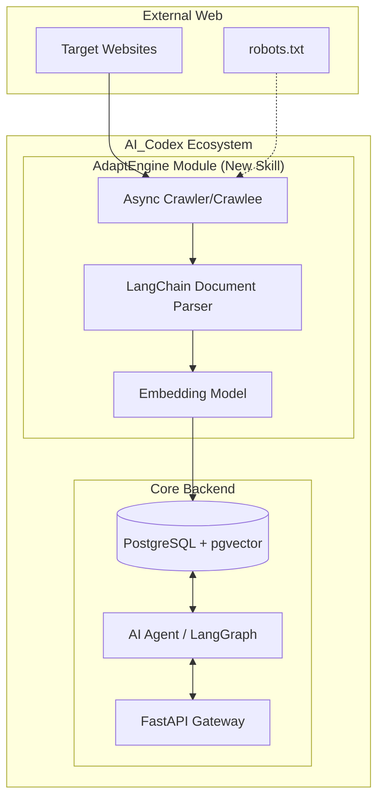
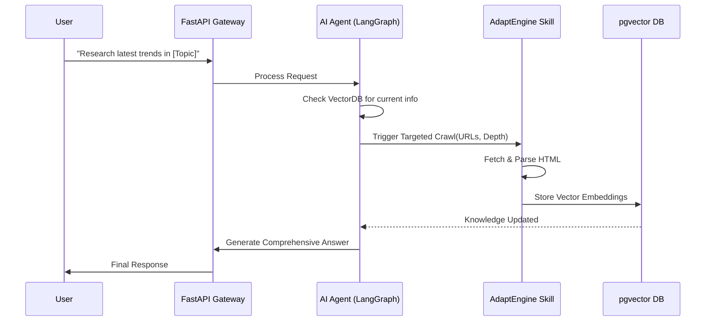

# AICodex Integration & Scaffolding Analysis
**Date:** 2026-07-03
**Project:** AdaptEngineV1 $\rightarrow$ AI_Codex Ecosystem

## 1. Discovery Findings: AI_Codex Backend
The discovery process on `C:\AppDev\My_Linkdin\projects\iarxii\AI_Codex` reveals a high-performance async architecture.
- **API:** FastAPI / Uvicorn
- **Database:** PostgreSQL with `pgvector` (Vectorized embeddings)
- **Orchestration:** LangChain / LangGraph (Agentic workflows)
- **Protocol:** MCP (Model Context Protocol) for skill extension.

## 2. High-Level Architectural Flow
The goal is to transform AdaptEngine from a standalone search engine into a **Knowledge Acquisition Skill** for the AI_Codex platform.



## 3. Sequence Diagram: Knowledge Ingestion Loop
This diagram illustrates how an AI_Codex agent can trigger a targeted crawl to update its knowledge base.



## 4. Scaffolding & Dependency Matching
To ensure zero friction during integration, AdaptEngine will adopt the AI_Codex base image and dependency lock.

### Dependency Alignment
| Component | AI_Codex Version | AdaptEngine Target | Integration Note |
| :--- | :--- | :--- | :--- |
| **Language** | Python 3.11+ | Python 3.11+ | Native match |
| **API Framework** | FastAPI | FastAPI | Deploy as a sub-router in AI_Codex |
| **Database** | PostgreSQL / pgvector | PostgreSQL / pgvector | Shared DB instance, separate schema |
| **Async Core** | asyncio / uvloop | asyncio / Crawlee | Full async compatibility |
| **LLM Framework** | LangChain | LangChain | Use existing AI_Codex embedding keys |

### Folder Scaffolding
The logic will be migrated from the PHP root to the following structure within the AI_Codex repo:
```text
AI_Codex/
└── backend/
    └── skills/
        └── knowledge_acquisition/
            ├── __init__.py
            ├── crawler/
                ├── engine.py        # Crawlee-based async logic
                ├── parser.py        # HTML to Markdown/Text conversion
                └── schema.py        # Pydantic models for crawled data
            ├── embeddings.py        # Integration with AI_Codex embedding pipeline
            └── router.py            # FastAPI endpoints for crawl control
```

## 5. Conclusion
By treating AdaptEngine as a "Skill" rather than a standalone app, we leverage the existing security, database, and AI orchestration of AI_Codex. This transforms the project from a basic search tool into a dynamic, self-updating memory layer for the cloud platform.
