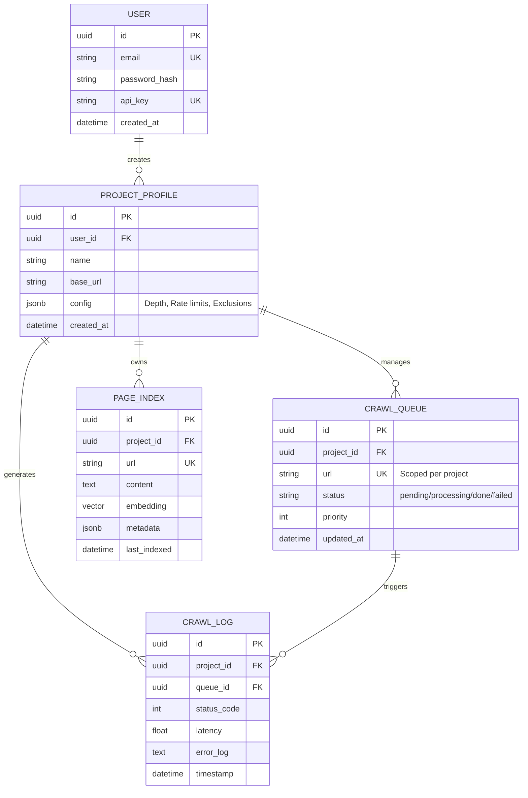

# AdaptEngineV1 - Expanded Entity Relationship Diagram

This document describes the expanded database schema to support multi-tenancy (Users & Projects) and system observability (Logs).

## 📊 Expanded ERD

## 📝 Architectural Changes

### 1. Multi-Tenancy
- **Isolation:** All crawling and indexing activities are now scoped to a `PROJECT_PROFILE`. This prevents data leakage between different users or different research projects.
- **Ownership:** The `USER` table manages authentication and API access.

### 2. Project Configuration
- The `config` field in `PROJECT_PROFILE` allows for per-project behavior:
    - `max_depth`: How many links deep to crawl.
    - `rate_limit`: Seconds to wait between requests.
    - `domain_whitelist`: Restrict crawling to specific domains.

### 3. Observability & Health
- **`CRAWL_LOG`**: Provides a historical audit trail. This allows the admin to see exactly why a specific URL failed (e.g., 403 Forbidden or Timeout) without digging through raw server logs.
- **Queue State**: `CRAWL_QUEUE` now tracks `updated_at` to identify "stuck" tasks that have been in `processing` for too long.

## 🚀 Implementation Path
1. **Schema Migration:** Update `models.py` and run migrations.
2. **Auth Layer:** Implement FastAPI Security (OAuth2/JWT) for the `USER` entity.
3. **Crawler Refactor:** Update `CrawlerWorker` to filter the queue by `project_id`.
4. **Logging Middleware:** Integrate `CrawlLog` writes into the `CrawlerWorker` loop.
